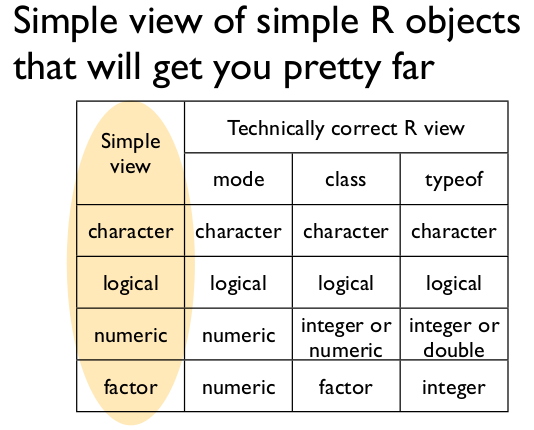

R Cheat Sheet
========================================================

## How to get help

**From the console:**

Type `?function_name` to see that function's Help page. Type `??search_term`` to
find all the functions in R (that you have downloaded) that contain your 
search term.

**On the internet:**

+ [Rseek](http://rseek.org/)
+ [Bioconductor mailing list](http://grokbase.com/g/r/bioconductor)
+ Use the tag "[r]" on [StackOverflow](http://stackoverflow.com/).

## How to stop


```r
q()  # exit R
# Use the escape key to kill a command
```


## Inspect an object

**Note:** Not all of these commands will work on every type of object.


```r
str(x)
head(x)
tail(x)
dim(x)
length(x)
nrow(x)
ncol(x)
attr(x)
class(x)
typeof(x)
mode(x)
plot(x)
hist(x)
boxplot(x)
hist(x)
summary(x)
unique(x)
colnames(x)
rownames(x)
length(x)
dput(x)
```


## Understanding your working environment


```r
ls()  # List all objects
search()  # List all attached packages
getwd()  # get the path of the current working directory
sessionInfo()  # summary of your system and R session, post this info when
# asking for help on mailing lists and online forums
```


## Data types



Diagram by [Jenny Bryan](http://www.stat.ubc.ca/~jenny/).

## Data structures

R has multiple native data structures. The table below shows an overview that
demonstrates how to choose which data structure to choose based on the number
of dimensions of the data and whether it is all the same type of data 
(homogeneous) or multiple types (heterogenous).

              | Homogeneous  | Heterogeneous
------------- | ------------- | ------------
**1d**  | Atomic vector | List
**2d**  | Matrix | Data frame
**nd**  | Array |

Table inspired by Hadley Wickham's 
[chapter](http://adv-r.had.co.nz/Data-structures.html) on data structures.

